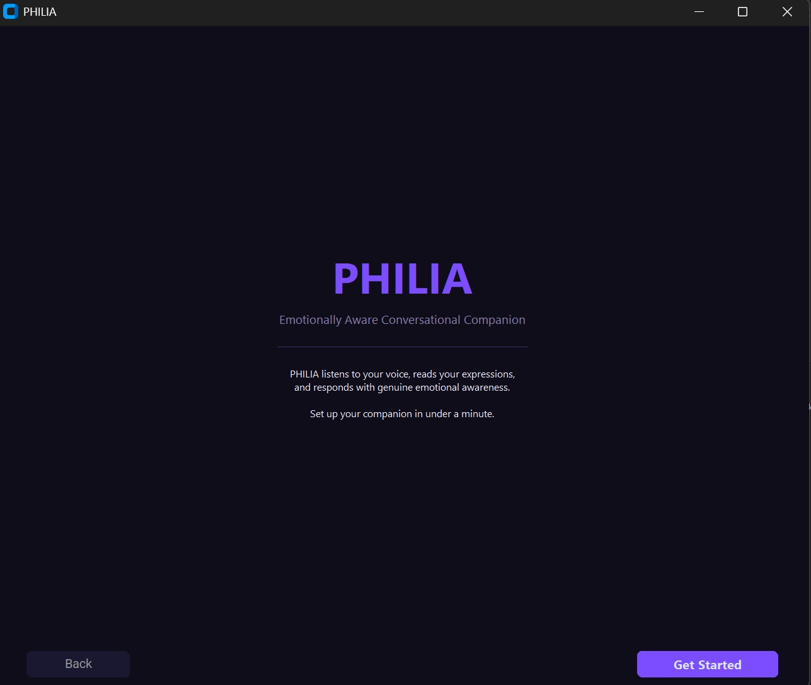
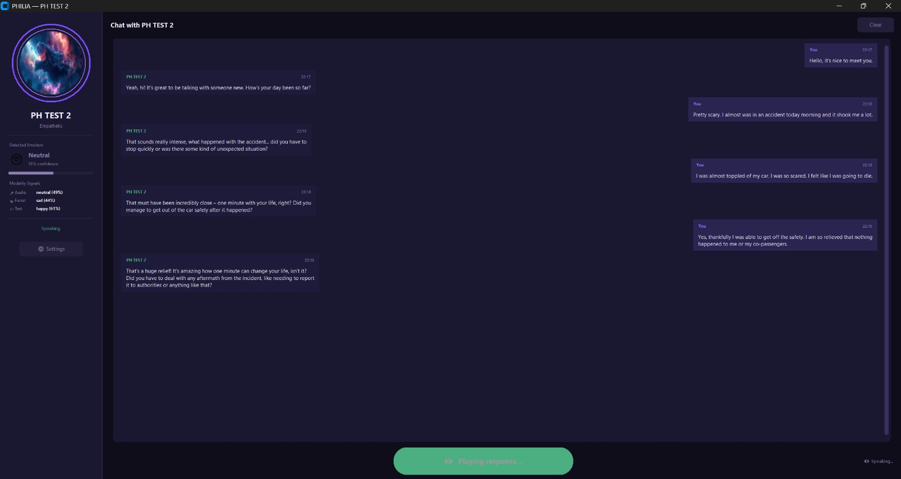
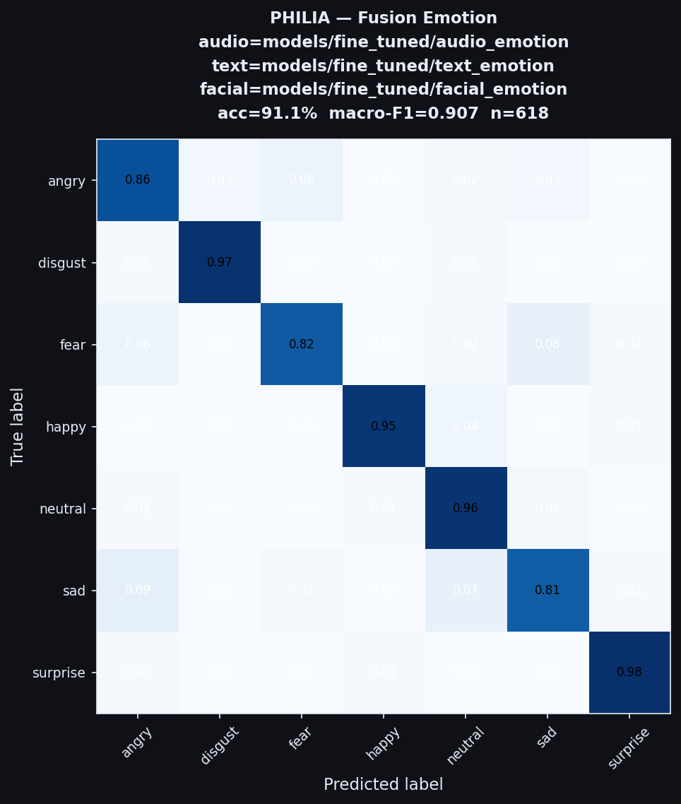
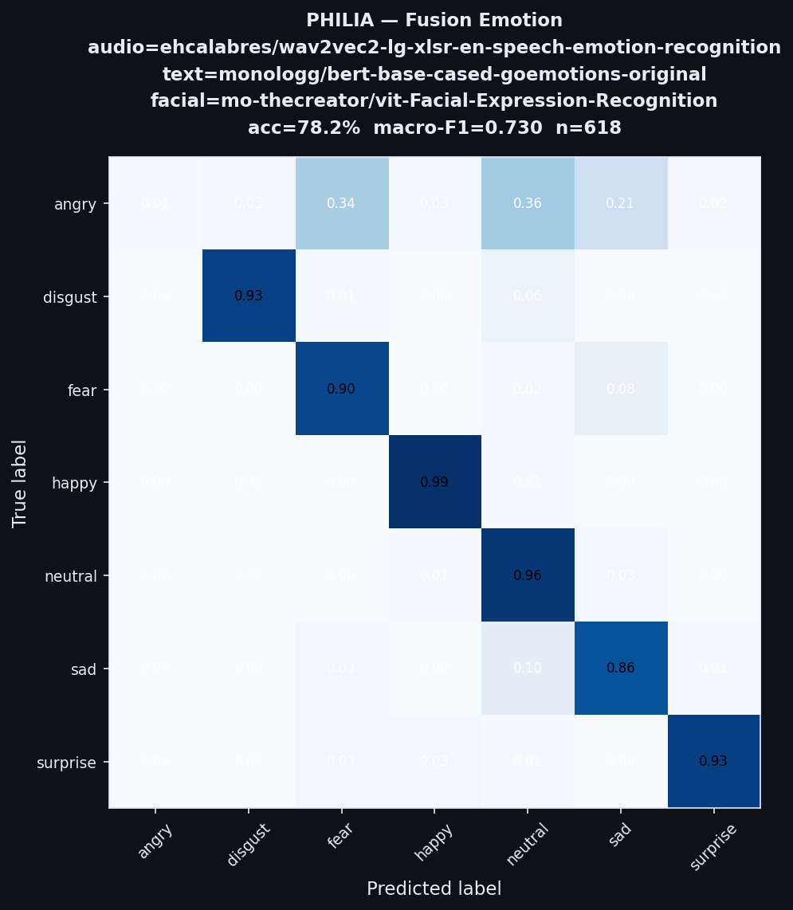
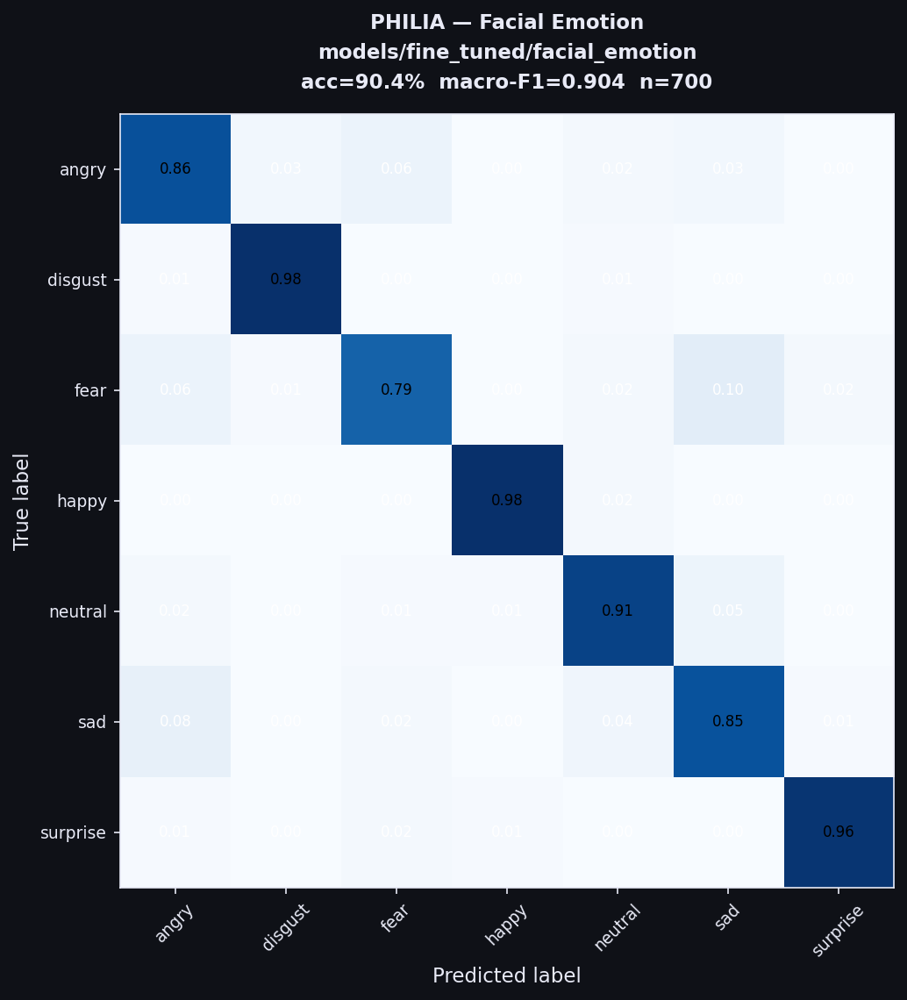
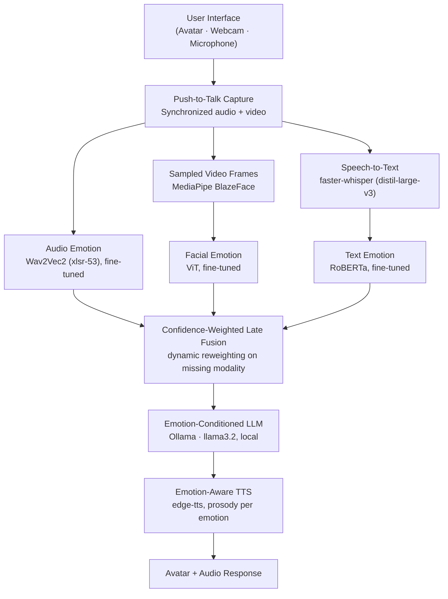

# PHILIA — Emotionally Aware Multimodal Conversational Companion

PHILIA is a locally-run desktop companion that detects a user's emotional state in real time from **speech, facial expression, and text**, fuses the three signals with a confidence-weighted late-fusion model, and responds through an emotion-conditioned local LLM and expressive neural TTS. Everything runs on-device — no audio, video, or transcript ever leaves the machine.

Submitted to **IEEE INDISCON 2026** (Submission ID 649).

<p align="center">
  
  
</p>

---

## Results

| Modality | Pretrained (baseline) | Fine-tuned |
|---|---|---|
| Audio (Wav2Vec2, xlsr-53) | 48.1% acc / 0.093 F1 | 46.9% acc / 0.158 F1 |
| Text (baseline: BERT-GoEmotions → fine-tuned: RoBERTa) | 45.2% acc / 0.282 F1 | 64.4% acc / 0.403 F1 |
| Facial (ViT) | 90.9% acc / 0.909 F1 | 90.4% acc / 0.904 F1 |
| **Fusion (all 3 modalities)** | 78.2% acc / 0.730 F1 | **91.1% acc / 0.907 F1** |

Fine-tuning the fusion stage lifts accuracy from 78.2% → 91.1% and macro-F1 from 0.730 → 0.907, evaluated on a MELD + FER2013 synthetic-alignment protocol (audio/text on MELD, facial on FER2013, n=618 for fusion). Facial expression is the single strongest signal on its own; audio alone is the weakest, biased heavily toward "neutral" due to the acted-speech → conversational-speech domain gap.

<details>
<summary><b>Ablation study</b> — which modality combinations matter</summary>

| Configuration | Accuracy |
|---|---|
| Audio only | 46.9% |
| Text only | 64.4% |
| Facial only | 90.4% |
| Audio + Text | 29.9% |
| Text + Facial | 86.1% |
| **All three (fusion)** | **91.1%** |

Audio + Text alone is *worse* than either modality individually — a weak audio signal actively drags down text when there's no strong visual anchor. Facial input is what stabilizes the fusion.
</details>

<details>
<summary><b>Confusion matrices</b></summary>

Fine-tuned fusion (91.1% / 0.907 F1):



Baseline (pretrained, no fine-tuning) fusion for comparison:



Facial modality alone (fine-tuned) — the most reliable single signal:


</details>

---

## Architecture



Models are loaded once at startup to keep inference latency low. When a modality is unavailable (silence, no face detected), its fusion weight is set to zero and redistributed proportionally across the remaining active modalities — this is what keeps the system stable when a channel drops out, rather than relying on fixed averaging.

**End-to-end latency** (NVIDIA RTX 3060, sequential pipeline): ~1.0–2.1s total, dominated by ASR (~300–600ms) and LLM response (~500–1000ms). Emotion detection across all three modalities combined adds <200ms.

---

## Models

| Modality | Base Model | Fine-tuning Dataset |
|---|---|---|
| Audio | `wav2vec2-lg-xlsr-en-speech-emotion-recognition` | RAVDESS (pretrain) → MELD (fine-tune) |
| Facial | `vit-Facial-Expression-Recognition` | FER2013 |
| Text | `roberta-base` | GoEmotions (pretrain) → MELD (fine-tune) |

All three are mapped to a common 7-class emotion space: `angry, disgust, fear, happy, neutral, sad, surprise`. Fine-tuned checkpoints live under `models/fine_tuned/`.

---

## How It Works

1. **Capture** — Mic and webcam record simultaneously while `Space` is held.
2. **Transcription** — Audio → text via faster-whisper, GPU-accelerated.
3. **Per-modality emotion detection** — audio, facial, and text models run independently and output normalized class probabilities.
4. **Fusion** — Confidence-weighted late fusion produces one canonical emotion label; weights redistribute automatically if a modality is inactive.
5. **Response generation** — Fused emotion + confidence + last 6 turns are injected into a personality-keyed prompt sent to a local Ollama model.
6. **TTS** — Response is synthesized with prosody (pitch, rate, tone) adjusted per detected emotion.

---

## Project Structure

```
main.py
  |
  +-- ui/                  Desktop GUI (CustomTkinter)
  |     setup_screen.py    First-run wizard (name, avatar, voice, microphone)
  |     chat_window.py     Chat interface with emotion HUD and animated avatar
  |     loading_screen.py  Splash screen with health-check progress
  |     interface.py       Window lifecycle and thread-safe UI API
  |
  +-- capture/             Push-to-talk recording
  |     audio_capture.py   Microphone via sounddevice
  |     video_capture.py   Webcam via OpenCV (kept warm between turns)
  |
  +-- speech/
  |     transcriber.py     faster-whisper ASR
  |     tts.py             edge-tts synthesis + pyttsx3 offline fallback
  |
  +-- emotion/
  |     audio_emotion.py   Wav2Vec2 inference
  |     facial_emotion.py  ViT inference + MediaPipe face detection
  |     text_emotion.py    RoBERTa inference
  |     fusion.py          Confidence-weighted late fusion
  |
  +-- llm/
  |     prompt_builder.py  System prompt construction with emotion + history
  |     response_generator.py  Ollama / OpenAI / Gemini backend routing
  |
  +-- tone/
  |     tone_mapper.py     Maps emotion label to TTS prosody parameters
  |
  +-- bot/
  |     bot_profile.py     Persona config (name, avatar, voice, mic) saved to JSON
  |
  +-- utils/
        health_check.py    Pre-launch checks (Ollama, models, webcam, mic)
        logger.py          Rotating file + UTF-8 console logger
```

---

## Configuration

Defaults live in `config.py`:

| Setting | Default | Description |
|---|---|---|
| `models.llm_provider` | `ollama` | LLM backend (`ollama`, `openai`, `gemini`) |
| `models.llm_model` | `llama3.2` | Model name passed to the provider |
| `models.device` | `cuda` | Device for Whisper (falls back to CPU if CUDA 12 not found) |
| `models.emotion_device` | `cpu` | Device for PyTorch emotion models |
| `fusion.audio_weight` | `0.15` | Base fusion weight for audio (redistributed if inactive) |
| `fusion.facial_weight` | `0.60` | Base fusion weight for facial (redistributed if inactive) |
| `fusion.text_weight` | `0.25` | Base fusion weight for text (redistributed if inactive) |

---

## Building

```powershell
.\build\build.ps1
```

Output is placed in `dist/PHILIA/` as a portable Windows directory bundle.

---

## Citation

The associated paper has been submitted to IEEE INDISCON 2026 (Submission ID 649) and is currently under review — not yet accepted or published. Update the entry below once a decision comes through; until then, cite it as a preprint/manuscript, not as a proceedings paper:

```
@unpublished{philia2026,
  title={PHILIA: Emotionally Aware Multimodal Conversational Agent},
  author={Achal K A and S Pranav Roy and Rudraraju Satvik Varma},
  note={Manuscript submitted to IEEE INDISCON 2026, under review},
  year={2026}
}
```
